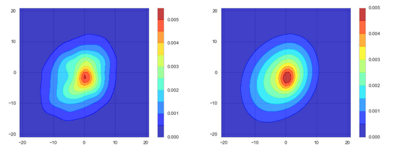
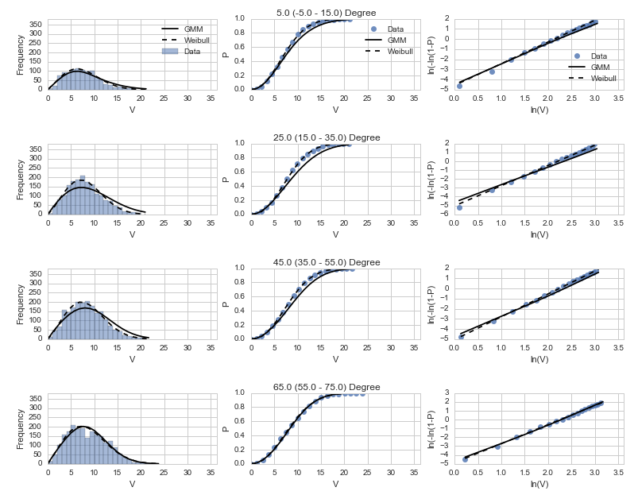

# Modeling the Joint Probability Distribution of Wind Speed and Direction using Gaussian Mixture Models

## What is this

This is a Python program for modelling the joint distribution of wind speed and direction.

The method is based on:

1. Harris, Cook, The parent wind speed distribution: Why Weibull?, http://www.sciencedirect.com/science/article/pii/S0167610514001056

2. Gaussian Mixture Modles, http://scikit-learn.org/stable/modules/mixture.html

## Fitting Effect

### 1. PDF (Probability Density Function) Comparison

Left: Empirical PDF, Right: Model PDF

### 2. Sectoral Comparison

Left: Histogram vs. Model, Middle: Empirical vs. Model CDF, Right: Weibull ECDF Vs. Model CDF

### 3. Live Demo

The above results are avaiable at
https://cdn.rawgit.com/cqcn1991/Wind-Speed-Analysis/master/output_HTML/marham.html
, along with other analysis results.

## Getting Started, for first-time Python Users

### 1. Install Anaconda

Download at
https://www.continuum.io/downloads

This repo use Python 2.7, so you should use the 2.7 version

### 2. Additional Environment Configuration

After installing Anaconda, there are still some additional packages need to install:

1. Seaborn
https://github.com/mwaskom/seaborn/
2. Windrose
https://github.com/scls19fr/windrose
3. jsmin
https://github.com/tikitu/jsmin

Just run

    pip install seaborn
    pip install windrose
    pip install jsmin

in your command line to install them

### 3. Download the current repo

### 4. Run the Jupyter Notebook, and open the file

If you have any question, you could post it at
https://github.com/cqcn1991/Wind-Speed-Analysis/issues
or mail me at 38306608#qq.com